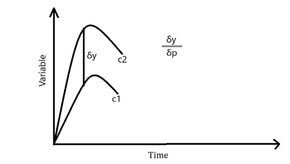
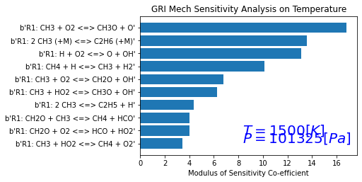
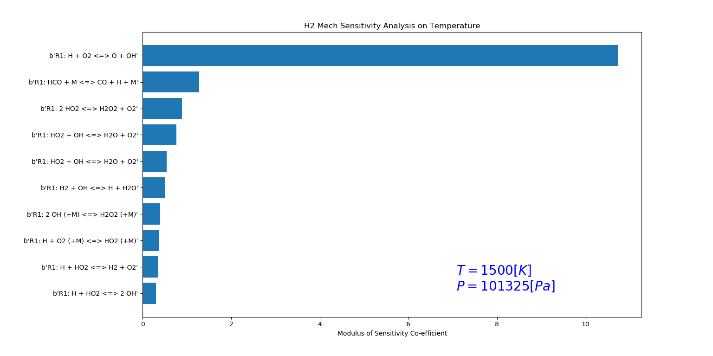

 # Methane Sensitivity Analysis

**Sensitivity Analysis** is a process to get the relationship between the parameters and the output of a model.

**Example:** Effect of reaction rate on the temperature or the species concentration.

## Generic ODE System:

A generic ODE system is represented as:

$$
\frac{dZ}{dt} = F(Z, t; a)
$$

where

$$
Z = \begin{bmatrix} T, Y_1, Y_2, \dots, Y_k \end{bmatrix}^T
$$

is a vector of species concentrations and temperature with respect to time, and

$$
a
$$

is the net reaction rate multiplier (Perturbation Factor).

## Parameters in the ODE:

The ODE has parameters which are represented by \(a\). For example, if we have 100 reactions, the rate constants for each of those reactions are our parameters. If we change the parameters, the ODE's function will also change accordingly.

## Sensitivity Matrix:

For the above ODE, we have a sensitivity matrix represented as:

$$
w_{j,i} = \frac{\partial Z_j}{\partial a_i}
$$

where:
- \( Z_j \) represents the corresponding variable (species or temperature),
- \( a_i \) represents the reaction rate constant for reaction \( i \).

So, if we have \( n \) reactions with \( k \) species and temperature, the size of the sensitivity matrix would be \( w_{k+1,n} \).

## Graphical Representation:

To have a better understanding of Sensitivity, consider the following graph:

  

<b>Figure 1:</b> Parameter Perturbation/Variation

The X-axis represents **Time**, and the Y-axis represents **Variable** (Temperature, Concentration, etc.). Let's say for a given reaction parameter, we get the curve $(c_1)$ as a function of time. When we change the parameter of $(c_1)$ by $(\delta p)$, which is $(p + \delta p)$, we obtain the curve $(c_2)$.

# Program Structure and Code

In this assignment, we are calculating the effect of all the reactions from the GRI mechanism file on the temperature parameter of sensitivity. We are using the **Ideal Gas Constant Pressure reactor** for this problem. The initial conditions for this reactor are given below:

- **Temperature**: 1500 Kelvin
- **Pressure**: 1 bar (101325 Pascals)

## Procedure

1. **Add reactions**:  
   Initially, we add the reactions from the GRI mechanism file to the reactor for the analysis.

2. **Set tolerances**:  
   We set the tolerances for both the solution and the sensitivity coefficient. There are two solution tolerances:
   - **Relative**: $(1.0e^{-16})$
   - **Absolute**: $(1.0e^{-15})$
   
   These values constrain the solution, ensuring that any change in the solution should be less than the specified tolerance.

   Similarly, the tolerances for the sensitivity coefficient are set as:
   - **Absolute**: $(1.0e^{-6})$
   - **Relative**: $(1.0e^{-6})$

3. **Analysis duration**:  
   We consider an analysis duration of about **2 milliseconds**, meaning the time integration starts from 0 to 2 milliseconds, with a **5-microsecond** time step. During each time step, we calculate the sensitivity with respect to the temperature parameter for all the reactions, and store them in a **2D array (Sensitivity Matrix)**.

4. **Sensitivity analysis**:  
   In this problem, we are determining the most sensitive reactions by considering both positive and negative sensitivities. After obtaining the sensitivity coefficients, we take the modulus of each coefficient and associate it with its respective reaction.

5. **Sorting reactions**:  
   Finally, we sort the reactions in the order of greatest to least sensitivity and produce the **top ten reactions** with the highest sensitivities.

## Applications

Reaction mechanisms aren’t always made with specific parameters in mind. For example, say we have a case of high EGR (Exhaust Gas Recirculation) conditions. The mechanism may not be valid for that condition or it may not give the desired results. To get the desired results, we have to change the co-efficient of the reactions i.e. tune the reactions to our problem specific parameters. But in the case of GRI mechanism, we have around 325 reactions and we cannot change them individually which would be a highly inefficient.

The purpose of Sensitivity Analysis is that we can tune the most sensitive reaction mechanisms i.e. we can adjust the rate co-efficient so that it will give us a match for the Ignition Delay. Engineers use this method to tune the reaction mechanisms to their problem specific parameters.

## Results

  

<b>Figure 2:</b> Top most CH4 Senstitive Reactions

  

<b>Figure 3:</b> Top most H2 Senstitive Reactions

The above figure shows a horizontal bar representation for the top ten reactions in the GRI mechanism file. The modulus of sensitivity co-efficient and the top reactions are represented in x and y axes respectively. These results tell us that of all the reactions in the GRI mechanism, 'CH3+O2⇔CH3O+O' reaction has the highest temperature senitivity.

When we obtain a positive sensitivity co-efficient, the temperature increases. Due to this, the Ignition Delay decrease because the ignition is happening at a faster rate. Similarly, when we have a negative sensitivity co-efficient, the burning is slow and respectively the Ignition Delay inreases.
To increase or decrease Ignition Delay, we can refer to the particular sensitivity co-efficients and change the rate co-efficients accordingly.
